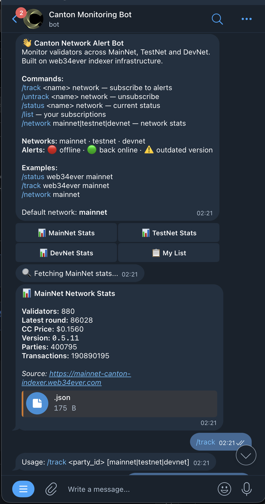
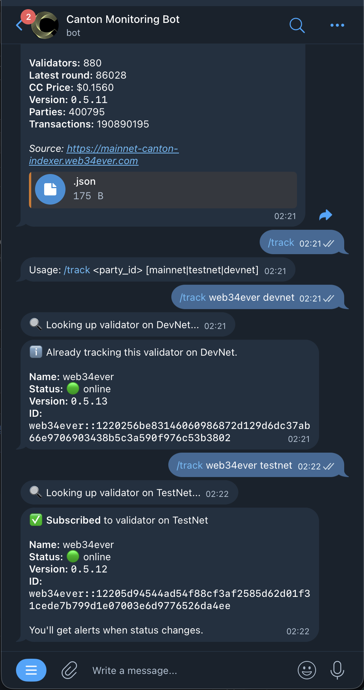

# Canton Alert Bot

Telegram bot for monitoring Canton Network validators across MainNet, TestNet and DevNet.

**[@canton_monitoring_bot](https://t.me/canton_monitoring_bot)**

## Demo

<p align="center">
  
  
</p>

## Features

- Track validators by name or partial party_id
- Alerts: offline, back online, outdated version
- **Validator node lag monitoring** — detects when the local validator node stops processing the ledger
- Node alerts include validator name pulled from the validator's own database
- Persistent reply keyboard — buttons always visible
- Uptime 7d shown in validator status
- Fallback data sources: our indexer → Lighthouse
- Per-network support: mainnet / testnet / devnet

## Usage

| Button / Command | Description |
|------------------|-------------|
| 🟢 Status / `/status <name> [network]` | Current validator status + uptime |
| ➕ Subscribe / `/track <name> [network]` | Subscribe to alerts |
| 🗑 Unsubscribe / `/untrack <name> [network]` | Unsubscribe |
| 📋 My List / `/list` | All your subscriptions |
| 📊 Network Stats / `/network [network]` | Network stats |

Default network: **mainnet**

## Alerts

### Validator status alerts (every 5 min)

| Trigger | Message |
|---------|---------|
| Validator inactive > 25 min (2 consecutive polls) | 🔴 Validator offline |
| Validator recovered | 🟢 Validator back online |
| Version behind network | ⚠️ Outdated version |

> Detection delay ~25 min — Canton round = 10 min, status updates once per round.

### Node lag alerts (every 60 sec)

Monitors how long ago the local validator node last ingested a ledger transaction.

| Trigger | Message |
|---------|---------|
| Lag ≥ 10 min | ⚠️ Validator node slow |
| Lag ≥ 20 min | 🔴 Validator node offline |
| Lag drops below 10 min | 🟢 Validator node recovered |

Node alerts are sent to all subscribers of that validator on the affected network.

## Data Sources

| Network | Primary | Fallback |
|---------|---------|----------|
| mainnet | mainnet-canton-indexer.web34ever.com | lighthouse.cantonloop.com |
| testnet | testnet-canton-indexer.web34ever.com | lighthouse.testnet.cantonloop.com |
| devnet | devnet-canton-indexer.web34ever.com | lighthouse.devnet.cantonloop.com |

Node status endpoint: `GET /api/validator/node-status` — served by the local indexer on each network server. Requires `VALIDATOR_DB_URL` to be set in the indexer (see canton-network-indexer README).

## Setup

### 1. Create Telegram bot

Talk to [@BotFather](https://t.me/BotFather) and get a `BOT_TOKEN`.

### 2. Deploy with Docker

```bash
cp .env.example .env
# Edit .env — set BOT_TOKEN and optionally ADMIN_CHAT_ID

docker compose up -d --build
```

### 3. Deploy manually

```bash
npm install
npm run build
BOT_TOKEN=your_token node dist/bot.js
```

## Environment Variables

| Variable | Required | Description |
|----------|----------|-------------|
| `BOT_TOKEN` | ✅ | Telegram bot token from @BotFather |
| `ADMIN_CHAT_ID` | — | Your Telegram chat ID for admin alerts and `/admin` command |
| `DB_PATH` | — | SQLite database path (default: `./data/bot.db`) |

## Architecture

```
Telegram ←→ grammy bot
              ↓
          monitor.ts
           ├── validator poll (every 5 min)
           │     ↓ fetchWithFallback()
           │     [our indexer] → [lighthouse direct]
           │
           └── node lag poll (every 60 sec)
                 ↓ GET /api/validator/node-status
                 [our indexer on each network server]
              ↓
          SQLite (subscriptions + validator state + alert log)
```

## Repository

Part of the [Canton Network](https://canton.network) ecosystem toolset.